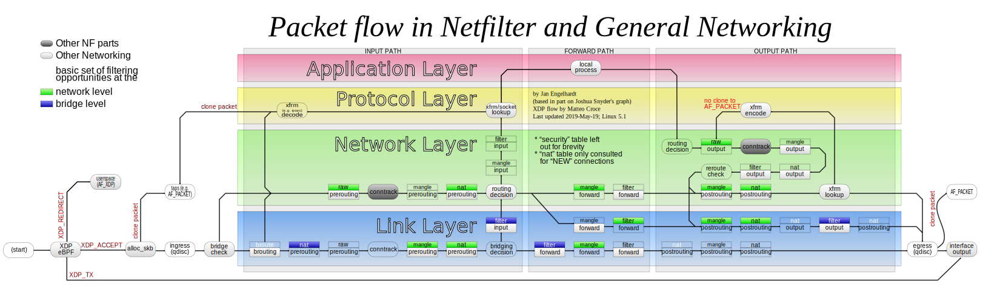

## iptables

> iptables is a user-space utility program that allows a system administrator to configure the tables provided by the Linux kernel firewall and the chains and rules it stores.

### Packet flow

#### Simplified

_For Routing decision, check [iproute2](./iproute2.md)_

```
                               XXXXXXXXXXXXXXXXXX
                             XXX     Network    XXX
                               XXXXXXXXXXXXXXXXXX
                                       +
                                       |
                                       v
 +-------------+              +------------------+
 |table: filter| <---+        | table: nat       |
 |chain: INPUT |     |        | chain: PREROUTING|
 +-----+-------+     |        +--------+---------+
       |             |                 |
       v             |                 v
 [local process]     |           ****************          +--------------+
       |             +---------+ Routing decision +------> |table: filter |
       v                         ****************          |chain: FORWARD|
****************                                           +------+-------+
Routing decision                                                  |
****************                                                  |
       |                                                          |
       v                        ****************                  |
+-------------+       +------>  Routing decision  <---------------+
|table: nat   |       |         ****************
|chain: OUTPUT|       |               +
+-----+-------+       |               |
      |               |               v
      v               |      +-------------------+
+--------------+      |      | table: nat        |
|table: filter | +----+      | chain: POSTROUTING|
|chain: OUTPUT |             +--------+----------+
+--------------+                      |
                                      v
                               XXXXXXXXXXXXXXXXXX
                             XXX    Network     XXX
                               XXXXXXXXXXXXXXXXXX
```

#### Full



### Commands

#### List the rules in a chain or all chains

- `iptables --list`
- `iptables -t nat -L`

#### Print the rules in a chain or all chains

- `iptables --list-rules`
- `iptables -t nat -S`

#### Debugging (tracing)

- `iptables -t raw -A PREROUTING -p tcp -j TRACE`
- `iptables -t raw -A OUTPUT -p icmp -j TRACE`
- `dmesg | grep TRACE`

#### Matching interfaces

> Interfaces are only resolved in the _Routing decision_ stages from the diagram above.
> This means that: \
> -i only works in INPUT, FORWARD and POSTROUTING chains \
> -o only works in FORWARD, OUTPUT and POSTROUTING chains

- `iptables -A INPUT -i wg-server -j ACCEPT`
- `iptables -A FORWARD -o wg-server -j ACCEPT`

### Targets

> Packets traverse a chain until they hit `ACCEPT`, `DROP`, `REJECT`, or `RETURN`. They do not stop on a match unless that match contains a terminating action

- `ACCEPT` means to let the packet through
- `DROP` means to drop the packet on the floor, i.e. to discard it and not send any response
- `REJECT` is used to send back an error packet in response to the matched packet: otherwise it is equivalent to `DROP`, so it is a terminating TARGET, ending rule traversal
- `RETURN` means stop traversing this chain and resume at the next rule in the previous (calling) chain. If the end of a built-in chain is reached or a rule in a built-in chain with target `RETURN` is matched, the target specified by the chain policy determines the fate of the packet

#### DNat (Destination NAT)

> This target is only valid in the nat table, in the `PREROUTING` and `OUTPUT` chains, and user-defined chains which are only called from those chains. It specifies that the destination address of the packet should be modified (and all future packets in this connection will also be mangled), and rules should cease being examined. It takes one type of option:

- `--to-destination ipaddr[-ipaddr][:port-port]`

#### SNAT

> This target is only valid in the nat table, in the `POSTROUTING` chain. It specifies that the source address of the packet should be modified (and all future packets in this connection will also be mangled), and rules should cease being examined. It takes one type of option:

- `--to-source ipaddr[-ipaddr][:port-port]`

#### MASQUERADE

> This target is only valid in the nat table, in the `POSTROUTING` chain. It should only be used with dynamically assigned IP (dialup) connections: if you have a static IP address, you should use the SNAT target. Masquerading is equivalent to specifying a mapping to the IP address of the interface the packet is going out, but also has the effect that connections are forgotten when the interface goes down. This is the correct behavior when the next dialup is unlikely to have the same interface address (and hence any established connections are lost anyway). It takes one option:

- `--to-ports port[-port]`

### Logging

- `iptables -A INPUT -p tcp -j LOG --log-level 1 --log-prefix "[prefix] "`

#### Containers

> Iptables `LOG` rules inside containers are suppressed by default. You can run ulogd in each container and use iptables `NFLOG` (or ULOG) rules instead of `LOG` rules. As of kernel 4.11, you can change this behavior on the host:

- `echo 1 > /proc/sys/net/netfilter/nf_log_all_netns`

### Resources

- https://wiki.archlinux.org/index.php/Iptables
- https://gist.github.com/mcastelino/c38e71eb0809d1427a6650d843c42ac2
- https://commons.wikimedia.org/wiki/File:Netfilter-packet-flow.svg
- http://www.adminsehow.com/2011/09/iptables-packet-traverse-map/
- https://backreference.org/2010/06/11/iptables-debugging/
- https://unix.stackexchange.com/questions/191607/iptables-and-return-target
- https://www.opsist.com/blog/2015/08/11/how-do-i-see-what-iptables-is-doing.html
